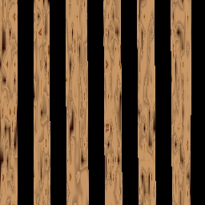



## SI'S DIRECT 3D PARADISE

### Description

A WHOLE 3D PARADISE TO WALK AROUND IN REAL TIME!!! This is my first Direct3D program (apart from a plain cube). It demonstates lots of the basic stuff you need to use to make a Direct 3D program, such as : Z-buffering, texture mapping, matrices, polygon sorting and scrolling backgrounds. The 3D world includes a plane and a boat, and some trees. All this packed into a 264KB download! I made the trees using a trick I saw on the game Tombraider - they are 2D sprites which turn to face the camera! Even if this don't teach you much, you can at least have a laugh at the ridiculously low polygon count and cheap effects. NOTE : YOU NEED DIRECTX 7 INSTALLED TO RUN THIS! For the best performance, close all other programs and run "Si's 3D Garden.exe" (included). See "readme.html" for more information. Please COME BACK AND VOTE FOR THIS because I don't think anyone else has given up the source code for a whole 3D world to Planet Source Code!
 
### More Info
 

             |
---                |---
**Submitted On**   |2000-08-13 10:50:18
**By**             |[Simon Price](https://github.com/Planet-Source-Code/PSCIndex/blob/master/ByAuthor/simon-price.md)
**Level**          |Intermediate
**User Rating**    |4.3 (197 globes from 46 users)
**Compatibility**  |VB 5\.0, VB 6\.0
**Category**       |[DirectX](https://github.com/Planet-Source-Code/PSCIndex/blob/master/ByCategory/directx__1-44.md)
**World**          |[Visual Basic](https://github.com/Planet-Source-Code/PSCIndex/blob/master/ByWorld/visual-basic.md)
**Archive File**   |[CODE\_UPLOAD89078132000\.zip](https://github.com/Planet-Source-Code/simon-price-si-s-direct-3d-paradise__1-10644/archive/master.zip)

